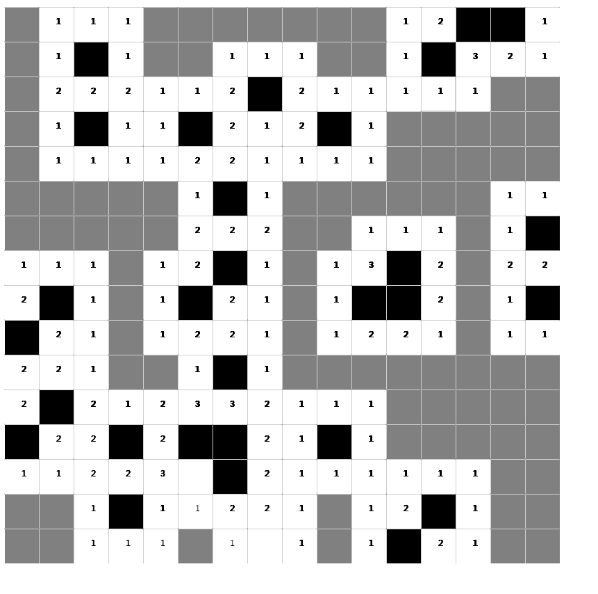

### 网页版扫雷游戏
使用HTML5中的cavans作为游戏场景，后台使用C++实现游戏算法，核心算法代码在[这里](https://github.com/ICKelin/mine-text)

同时，作为Cover的一个使用Demo，服务器端使用Cover来作为http解析处理层。

### 如何使用
游戏服务器端在Linux平台下运行，可以修改config.xml来进行后端配置，配置的内容包括

```
// 截至2017-04-15
struct Config {
        string  Version;                //版本
        bool    IsDebug;                //是否调试版
        int     Port;                   //监听端口
        string  Domain;                 //域名
        string  StaticFileUrl;          //静态文件url
        string  StaticFileRoot;         //静态文件路径
        string  TemplateFileRoot;       //模版文件路径
        bool    RequestLogEnable;       //请求是否记录日志

        int     LogFileEnable;          //文件日志是否启动
        string  LogFilePath;            //日志文件的路径

};

```

启动游戏服务器之后在浏览器访问网页即可进入游戏

### 游戏截图


